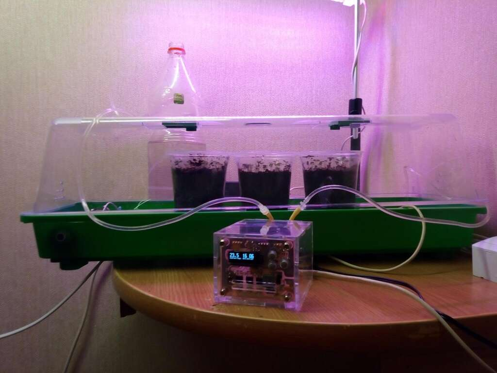

## Darkbloom, the home greenhouse controller (abandoned)

This is an old project aimed at creating a controller for a home-scale greenhouse. It was never developed completely, so it's here mostly for historic (or nostalgic, even) reasons. The PCB (and software) contain errors, making it basically impossible to build without hacking the board and the software.

## Some notes on design

Controller was designed to have a 24-volt input and 3 power outputs for a pump, heater and lights. It also has a temperature sensor and RTC.

There is no built-in relay for the lights - it was assembled outside the case. The pump is mounted on the case itself.

I used a giant 50W resistive element as a heater. It was doing its job fine, but God knows where you can get something similar?

The display pads are routed incorrectly, so the length of the flat cable from the display is not enough to locate the display reasonably. I had to use a piece of IDE HDD cable to move the display to the right location.

Software bitbangs the heater based on the temperature sensor measurements (NOTE that it doesn't have any overrun / underrun protection and will happily burn the heater even if there is no heating going on). It also enables and disables the light automatically according to the settings.

Settings are most likely not persistent and will be reset during power off.

Software lacks the ability to adjust current time, thought the way the RTC module is designed it can be pulled out from the board and adjusted externally.

Auto-watering was most likely never implemented correctly, so you only can switch the pump on and off manually

